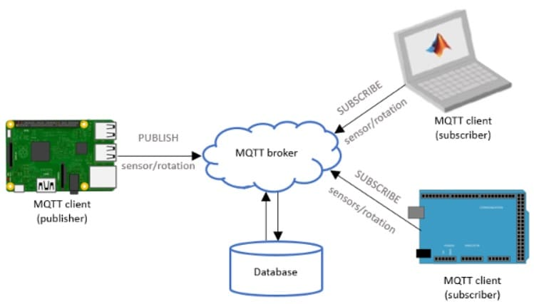
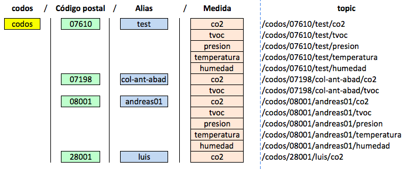

# 💪CODOS💪

**Compartir información siempre es beneficioso. Y en caso de la experimentación con sensores, una necesidad. No solo la información se enriquece. Si no que permite el ajuste y la corrección de sensores que en muchos casos no son precisos y cuyos valores estamos enseñando.**

Hay un stack de aplicaciones libres y abiertas que se utilizan en los proyectos Makers muy adecuada para este caso. Son recursos necesarios para permitir la comunicación, persistencia y visualización de los datos.

## Interconectividad
### MQTT
Mosquitto es un broker MQTT de Eclipse muy utilizado sobre Raspberry Pi. Permite un envío asíncrono de información asociado a colas (_topics_). Una manera muy simple de enviar información entre sensores y bases de datos o aplicaciones frontales como cuadros de mando.

**TOPICS**
Es importante crear una estructura funcional y sobre todo auto-explicativa. De manera que, de la subscripción a cualquier nivel, se obtenga información uniforme y coherente. Se propone:

El alias debe ser único por código postal y dispositivo. Si tienes dudas, puedes hacer una subscripción usando el _wildcard_ /codos/07610

**Servidor**
Se ruega encarecidamente un uso comedido de este servidor Mosquitto ya que, de momento, cuenta con recursos limitados. Fíjate que el puerto no es el propio de MQTT: 1883. Si no el 48052.
 
[domohome.ddns.jazztel.es:48052]("http://domohome.ddns.jazztel.es:48052")

### Endpoint API REST
_(Pendiente de definir)_

## Persistencia
### InfluxDB
_(Pendiente de definir)_

## Visualización
### Grafana
_(Pendiente de definir)_
