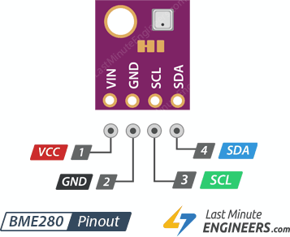

# 💪CODOS💪

## Un sistema de bajo coste basado en ESP32 para la detección del CO2 y otras variables ambientales para monitorizar la calidad del aire en el aula (o en otros lugares de trabajo)

*"Algunos científicos comentan que mejorar la ventilación y la calidad del aire es un método que las escuelas pueden usar para reducir el riesgo de transmisión del coronavirus.
Sin embargo, en una encuesta entre distritos escolares grandes del Norte de Texas, The Dallas Morning News encontró que las escuelas están lejos de alcanzar los parámetros de calidad del aire propuestos en junio por expertos en construcción.  
Investigadores de la Universidad de Harvard recomendaron instalar filtros de aire de alta graduación, limpiadores de aire portátiles y fuentes de luz ultravioleta dentro de los conductos de aire para eliminar al virus.
Al revisar el nivel de dióxido de carbono en las aulas se puede comprobar si está entrando suficiente aire fresco..."*

Fuente: https://noticiasenlafrontera.net/escuelas-no-siguen-recomendaciones-de-calidad-del-aire-parar-reducir-exposicion-a-covid-19/

Existen además evidencias de que los altos niveles de CO2 influyen sobre el rendimiento de los alumnos en el aula.
https://pubmed.ncbi.nlm.nih.gov/25117890/

Artículos cómo este me han llevado a elaborar un pequeño dispositivo de bajo coste que permita monitorizar los niveles de CO2 en las aulas con el objeto de poder medir la concentración de dicho gas y de esta forma saber cuándo tenemos que renovar el aire de un aula para poder seguir de la mejor forma posible las propias indicaciones al respecto de las administraciones públicas españolas:

https://www.miteco.gob.es/es/ministerio/medidas-covid19/sistemas-climatizacion-ventilacion/default.aspx

Si quieres saber más no dejes de leer este interesantísimo hilo en twitter: https://twitter.com/PabloFuente/status/1297457593368088576

Utilizando una hoja de cálculo podemos calcular la cantidad de CO2  en función de diversas variables del aula. En el siguiente artículo tenemos una calculadora que permite hacer dicho cálculo:

https://medium.com/@jjose_19945/how-to-quantify-the-ventilation-rate-of-an-indoor-space-using-a-cheap-co2-monitor-4d8b6d4dab44

## ¿Qué es 💪CODOS💪?

💪CODOS💪 es un pequeño circuito electrónico construido sobre un microcontrolador ESP32, un microcontrolador similar a un Arduino pero que ofrece conectividad WiFi y Bluetooth. Esto lo convierte en un dispositivo de Internet de las Cosas, (IoT) lo que nos permite monitorizar los datos de los sensores conectados al mismo a través de Internet. El dispositivo está pensado para medir la cantidad de CO2 y otros parámetros ambientales para recomendarnos cuando deberíamos renovar el aire de un aula cuando no se disponga de un sistema de ventilación forzada, o bien no sea posible mantener las ventanas abiertas todo el tiempo.

* Con un simple Arduino, un sensor de CO2 y unos led podemos construir un sistema simplificado que permita indicar cuando los niveles de CO2 están dentro de unos determinado umbrales, esa fue mi primera idea y publicaré también esta versión; pero cambiando el Arduino por un ESP8266 o un ESP32 podemos además enviar los datos a un servidor y monitorizar por ejemplo los datos de distintas aulas de forma centralizada, almacenar datos estadísticos en una base de datos o realizar otras muchas tareas que podrían sernos útiles sin incrementar prácticamente el coste del dispositivo.

### BOM (Bill of materials) / Lista de materiales
En su versión IoT, para construir CODOS se necesitan los siguientes elementos:
- Un ESP32 por ejemplo el ESP32-DOIT-DEVKIT
- Un sensor de CO2 CC811 (he probado también con otros sensores como el Sensirion SDC30 pero su coste es mucho más elevado)

 

- Opcionalmente un sensor de humedad, presión y temperatura BME280
- Opcionalmente leds de varios colores por ejemplo rojo, naranja y verde para construir un "semáforo" que indique los niveles de CO2
- Opcionalmente una pantalla OLED SSD1306 u otra

    

Téngase en cuenta que los datos podrán visualizarse desde cualquier dispositivo conectado a la misma red que CODOS: el ordenador del profesor, una tablet o un móvil, incluso puede conectarse a Internet y enviar los datos a un servidor externo para que estos puedan visualizarse desde cualquier sitio, por lo que los elementos opcionales se utilizarán o no en función de las necesidades de cada caso.

### El circuito
La conexión de los sensores es muy sencilla, tanto el sensor de CO2 como el sensor ambiental utilizados utilizan conexiones i2c, es decir basta con alimentarlos a 3.3V y masa y conectar a los GPIO22 y GPIO21 que en el ESP32 corresponden a las conexiones SCL y SDA del mencionado protocolo respectivamente.
Para la conexión de los diodos led al tratarse de salidas de 3.3V deberíamos utilizar resistencias limitadoras de corriente y conectarlos a través de estas a cualquiera de los GPIO, yo he escogido los GPIO9, 10 y 11. Al conectar los diodos led hemos de tener en cuenta su polaridad.

### El código

### El dispositivo
He diseñado una caja imprimible en 3D para poder albergar el dispositivo aunque este puede montarse directamente sobre una placa de prototipos si no se tiene la habilidad para soldar unos cuantos componentes aunque su montaje debería resultar especialmente sencillo.

#### Usando el dispositivo
El dispositivo se conecta automáticamente a la red del aula para permitir que los datos de los sensores pueden visualizarse en una página web que genera el dispositivo desde cualquier otro dispositivo conectado a la misma red. Para ello debes averiguar la dirección IP del dispositivo y abrir en tu navegador una URL del tipo siguiente: http://192.168.1.105 dónde los números indican la dirección IP local del dispositivo en la red local. 

### Preguntas frecuentes

**¿Dónde comprar los componentes?**

El ESP32 y los leds se pueden comprar en muchas tiendas físicas de electrónica en España o a través de Internet. En China por supuesto resultan mucho más económico; pero tardarás en tenerlo varias semanas en tener los componentes en tus manos.
Los sensores son un poco más difíciles de localizar en tiendas físicas pero puedes adquirirlos igualmente en China o un poco más caros encontrarlos a través de ebay o Amazon.

*(este documento está en redacción)*
