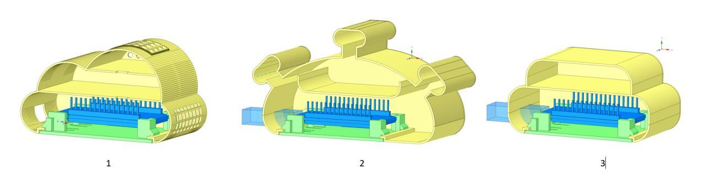

# 3D printable housings for CODOS air quality sensor based on ESP32/8266s & Arduinos
Housings with lot of space to hold several sensors and due to an interchangable base adaptable to all kinds of development board form factors. 

## Variety of holding bases:
* ESP32 30 pin, 51,5 x 28,5 mm
* ESP32 38 pin, 58 x 28 mm
* ESP8266 30 pin (NodeMCU), 58 x 31,2 mm
* ESP32-CAM, 40 x 27 mm
* TTGO T1 38 pin, 53,8 x 26,9 mm
* NANO 30 pin, 43,7 x 18 mm
* Wemos D1 mini, 34,2 x 25,4 mm - credits to Luc3as https://github.com/Luc3as/Air-quality-Sensor - based his design on https://www.thingiverse.com/thing:2997734
* UNO, 68,8 x 53 mm - Attention: needs housing "bicho_100_para_UNO"

## Different shapes
* "Virus" shaped
* "Cloud" shaped - credits to Luc3as https://github.com/Luc3as/Air-quality-Sensor - based on his design on https://www.thingiverse.com/thing:2997734 
* to come: Rectangular with rounded corners

## Versions
* v0.7 added case & base for UNO, reduced wall thickness
* v0.6 correction "bicho", base Wemos D1 mini added, "cloud" added
* v0.5 correction base TTGO T1, added premarked holes for LEDs
* v0.4 added version for 0.96" OLED + two more bases (TTGO T1 + NANO)
* v0.3 added side holes on top tentacle for better breathing of MH-Z19P sensor
* v0.2 initial release

# License
 CODOS case "bicho" by @Andreas_IBZ (Telegram) is licensed under a <a rel="license" href="http://creativecommons.org/licenses/by-nc-sa/4.0/">Creative Commons Attribution-NonCommercial-ShareAlike 4.0 International License</a>.
